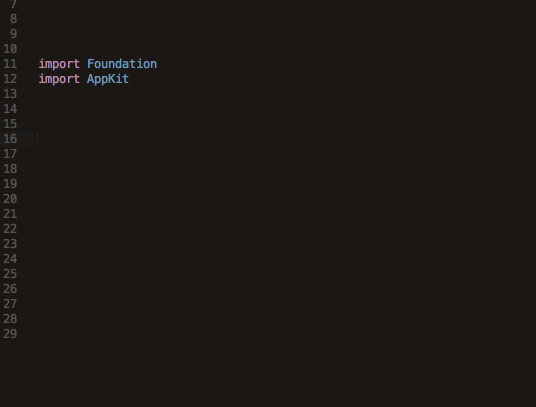
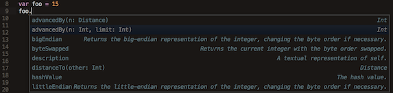
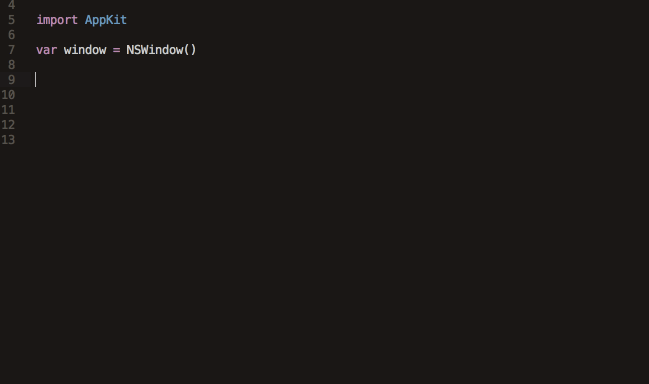

## SwiftKitten

SwiftKitten is a Swift autocompleter for Sublime Text, via the adorable 
[SourceKitten](https://github.com/jpsim/SourceKitten.git) framework.
Faster than XCode !





This package is new and still in beta! I welcome any suggestions. If
you find a bug, please open an issue. If you want to contribute, feel
free to fork and submit a pull request.


### Installation

First, make sure to install [SourceKitten](https://github.com/jpsim/SourceKitten.git) !

SwiftKitten is not yet available via Package Control (soon hopefully).

To install manually, clone this repository into your packages directory:

`git clone https://github.com/johncsnyder/SwiftKitten.git`

In Sublime, run `Preferences: Browse Packages`  from the command palette 
to find your packages directory. 


### Dependencies

The dependencies are included with the SwiftKitten package.

#### ijson

SwiftKitten uses [ijson](https://pypi.python.org/pypi/ijson) to parse
completions results from SourceKitten. By default, SwiftKitten will use
the pure python backend. If the faster `yajl2_cffi` backend is available,
SwiftKitten will automatically load it. It is highly recommended that
you build the cffi backend.


#### cffi [optional]

Navigate to `[Packages]/SwiftKitten/cffi/` and run `python setup.py build`.
This will build cffi in place. Maybe sure to run this command with `python3.3`.
Must be compatible with Sublime. Next time you start Sublime, SwiftKitten will
load the `yajl2_cffi` backend. 


### Caching

SwiftKitten uses [pygments](http://pygments.org) to parse autocomplete
prefixes and caches the result for the next time you request it. There will
be a slight delay the first time you autocomplete a function, but the next
time, it will be instantaneous. For example



SwiftKitten will remember the autocomplete results for `foo` and cache them.
The next time you type `foo.`, SwiftKitten will return the cached results.
Also, an autocomplete request will be sent if the cached results have timed
out (See `cache_timeout` in package settings). If the results
have changed, SwiftKitten will update the autocomplete window. A default
cache timeout of one second ensures you will always be shown up-to-date results,
while preventing a barrage of unnecessary requests to SourceKitten.

To clear the cache manually, run `SwiftKitten: Clear Cache` from the command
palette (this clears the framework cache also).


### Frameworks

SwiftKitten parses your file to find imported frameworks automatically.
SwiftKitten requests and caches framework globals separately, since they
are only needed once and requesting them via SourceKitten can take a while
(e.g. 20-30 seconds for Foundation).  It is possible to exclude specific 
frameworks from autocompletion results (See `exclude_framework_globals` in 
package settings).

The framework cache is persistant between sessions. It is saved to
Sublime's cache folder on saving a view, and is loaded next time SwiftKitten
is loaded.


##### External frameworks

Please provide a list of paths to external frameworks in settings under
`extra_framework_paths`. These are passed to SourceKitten via compilerargs.


### Documentation [experimental]

Running `SwiftKitten: Display Documentation` from the command palette,
or by pressing `ctrl+alt+d` will search a docset (path specified in settings)
via _docsetutil_ and display the most relevant entry in an html popup.





### Settings

See `SwiftKitten.sublime-settings` for more settings and information.
Copy this file to `[Packages]/User` to customize the settings.


```js
/*
    SwiftKitten default settings.

    All settings can be overriden in a sublime project file.
*/
{
	/* 
		Path to SourceKitten binary.
		See `https://github.com/jpsim/SourceKitten`.
	*/
	"sourcekitten_binary" : "/usr/local/bin/sourcekitten",

	/*
		sdk to link with. SourceKitten will find the 
		default sdk (OS X) if left blank.
	*/
	"sdk" : "",

	/*
		Extra framework search paths.

		To enable autocompletion for external frameworks, 
		add the path to the directory containing the 
		framework here.
	*/
	"extra_framework_paths" : [],

	/*
		Extra compiler arguments to SourceKitten.
	*/
	"extra_compilerargs" : "",

	/*
		Exclude globals from specific frameworks in auto-
		completion results. For example, `import Foundation`
		adds a lot of bloat to autocomplete results, and can 
		slow down typing.
	*/
	"exclude_framework_globals" : ["Foundation"],

	/*
		Timeout for cached completion data (in seconds).
	*/
	"cache_timeout" : 1.0,
	
	/*
		Limit to number of concurrent completion requests.
	*/
	"concurrent_request_limit" : 4,

	/*
		Enable linting. This will query structure info via
		SourceKitten, and underline any parse errors. Move 
		the cursor to the error position to see the error 
		description in the status bar.
	*/
	"linting" : true,

	/*
        Supress Sublime Text regular completions.
    */
	"suppress_word_completions" : true,
	"suppress_explicit_completions" : true,

	/*
		Path to docset.

		Running `ctrl+alt+d` will search the docset for the
		current word or selection and display the docs in
		a popup.
	*/
	"docsetutil_binary" : "/usr/local/bin/docsetutil",
	"docset" : "/Applications/Xcode.app/Contents/Developer/Documentation/DocSets/com.apple.adc.documentation.OSX.docset"
}
```


Additionally, settings can be overridden in a sublime project file.

It is recommended to add the following to user or Swift syntax specific preferences:

```js
"auto_complete_triggers": [ {"selector": "source.swift", "characters": "."} ]
```


### Troubleshooting


If autocompletion is not working, pull up the Sublime python
console (``ctrl+` ``) and see if any error messages are reported.


### TO DO


- Add support for multi-file projects/modules (e.g. specified in
	a sublime project file).

- Parse Xcode project to get file list and embedded frameworks 
	(similiar to SourceKittenDaemon).

- Build cffi automatically on sublime package install ?
	I'm not sure if sublime's python interpreter has the
	necessary tools to build it. Tried briefly but could
	not get it to work.


### License

SwiftKitten is MIT licensed.
